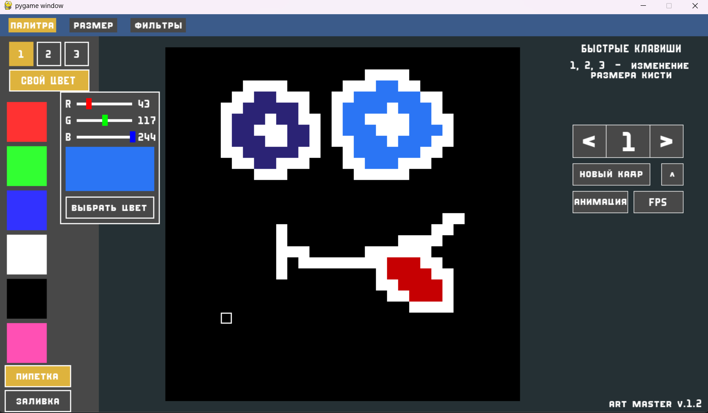
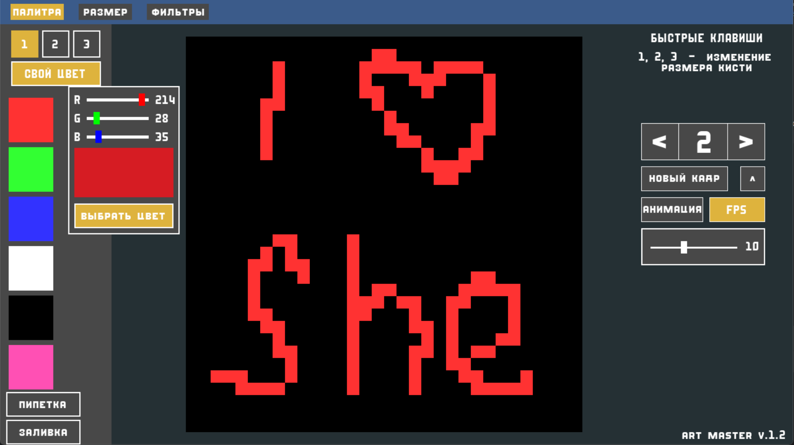

# **Art Master**
*version 1.2*
## Preview

---

## Technologies
- **Python**
- **Pygame**

---

## Features
- Drawing
- Eye Dropper
- Filler
- Animation
- FPS changer
- RGB changer colors
- Change size of Brush

---

## What I Learned
- work with Pygame 
- work with big project with many files
- create first simple system
- think about future features
- create new classes and use it

---

## Known Issues
***No***

### Thanks for looking <3
